# Guide : Installation de VMware Workstation Pro (Usage Personnel)
Ce tutoriel explique comment télécharger, configurer et installer **VMware Workstation Pro** gratuitement depuis l'acquisition par Broadcom.

---

## Sommaire
- [1. Inscription sur le portail Broadcom](#1-inscription-sur-le-portail-broadcom)
- [2. Accès aux téléchargements VMware](#2-accès-aux-téléchargements-vmware)
- [3. Validation de la conformité (Trade Compliance)](#3-validation-de-la-conformité-trade-compliance)
- [4. Installation et Configuration de VMware Workstation Pro](#4-installation-et-configuration-de-vmware-workstation-pro)

---

## 1. Inscription sur le portail Broadcom

1. Ouvrez votre navigateur et rendez-vous sur le [Broadcom Support Portal](https://support.broadcom.com/).
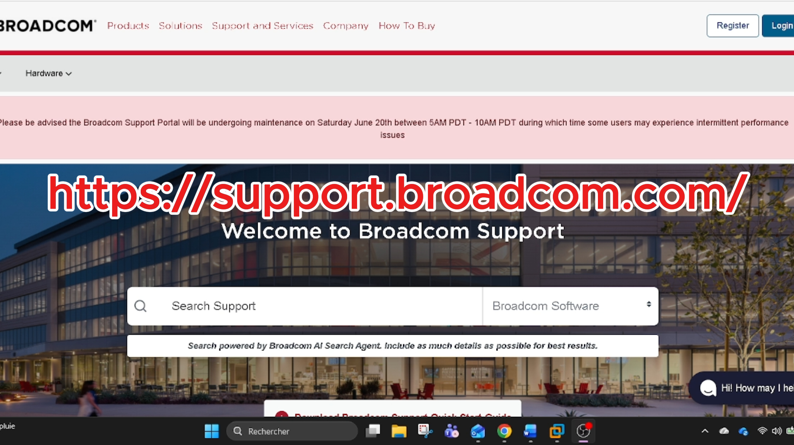

2. En haut à droite de la page, cliquez sur le bouton **Register** pour lancer l'inscription.
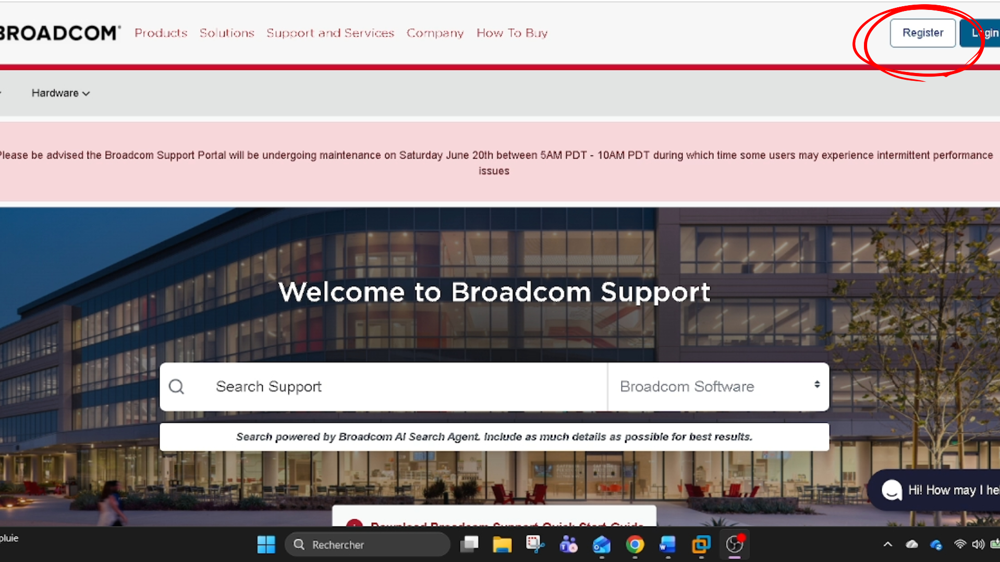

3. Entrez ensuite votre adresse e-mail, complétez le petit captcha de sécurité pour prouver que vous n'êtes pas un robot, et cliquez sur **Next**.
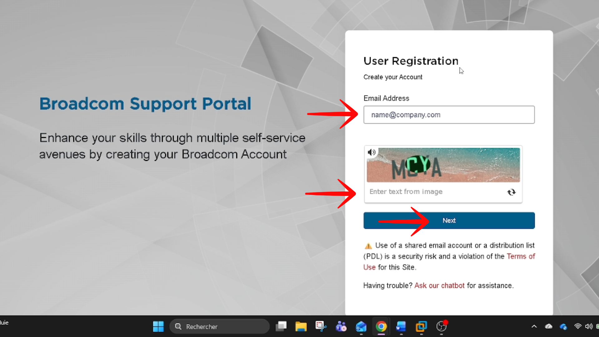

4. Broadcom va vous envoyer un code de vérification par mail. Allez jeter un œil à votre boîte de réception, copiez ce code, puis collez-le sur le site avant de cliquer sur **Verify & Continue**.
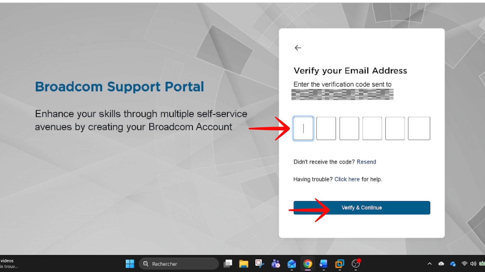

5. Il ne vous reste plus qu'à remplir vos informations de base, à accepter les conditions d'utilisation, et à cliquer sur **Create Account**.
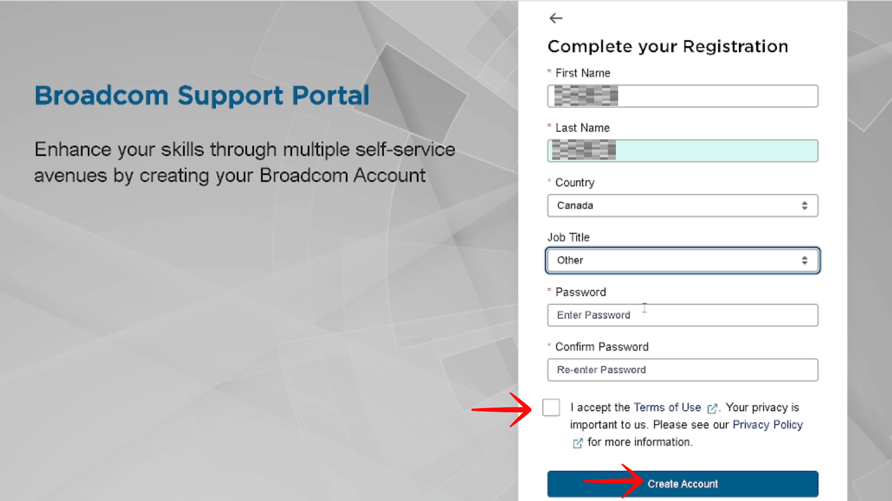

6. Une fois que le compte de base est créé, le site vous propose d'ajouter d'autres services. Ne vous embêtez pas avec ça pour l'instant : cliquez simplement sur **I'll do it later** (Je le ferai plus tard).
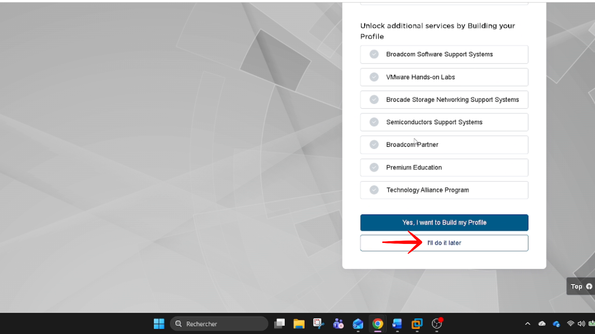

---

## 2. Accès aux téléchargements VMware

7. Maintenant que notre compte est prêt, retournez sur `support.broadcom.com`. En haut à droite, sélectionnez **Support Portal** et connectez-vous si ce n'est pas déjà fait en cliquant sur ****Login**.
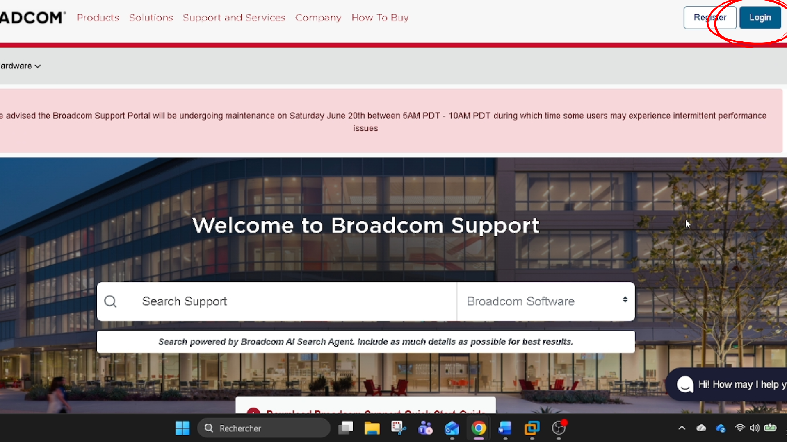

8. Une fois connecté, repérez le menu déroulant en haut de la page et choisissez la division **VMware Cloud Foundation**. C'est ici que se cachent les logiciels VMware.
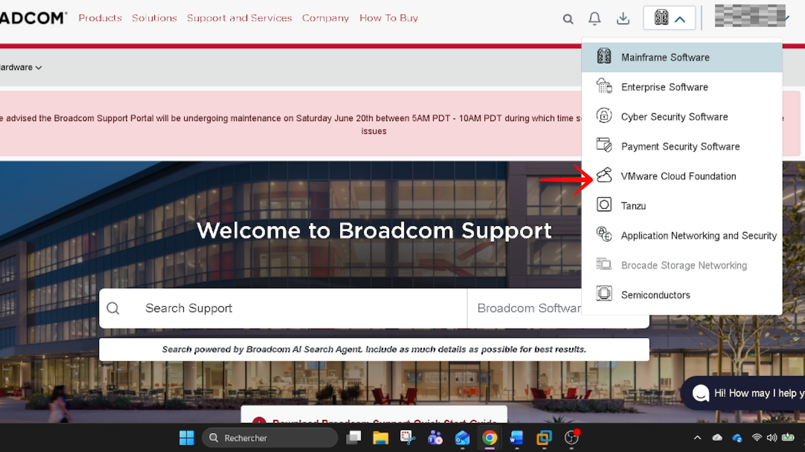

9. Dans le menu de gauche, cliquez sur **My Downloads**. Vous allez voir apparaître un lien hypertexte intitulé `Free Software Downloads available HERE` (Téléchargements de logiciels gratuits disponibles ICI). Cliquez dessus !
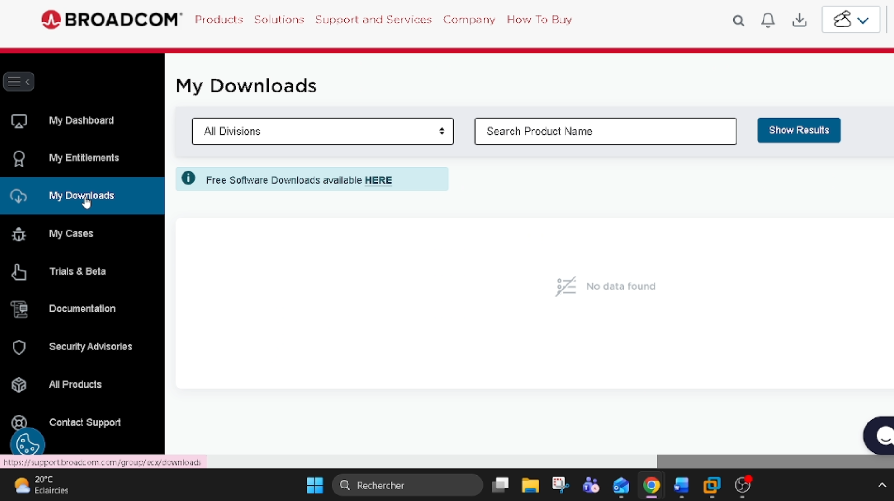

10. Dans la barre de recherche qui s'affiche, tapez simplement `workstation` et cliquez sur le résultat de recherche correspondant. 
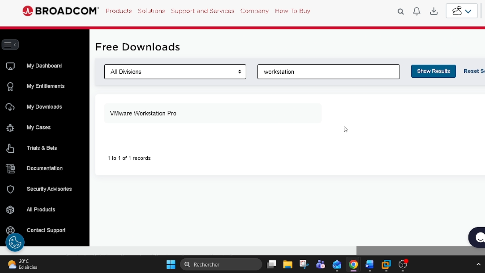

11. On cherche la ligne **VMware Workstation Pro 17.0 for Windows** (ou pour Linux si vous êtes sur cet OS). 
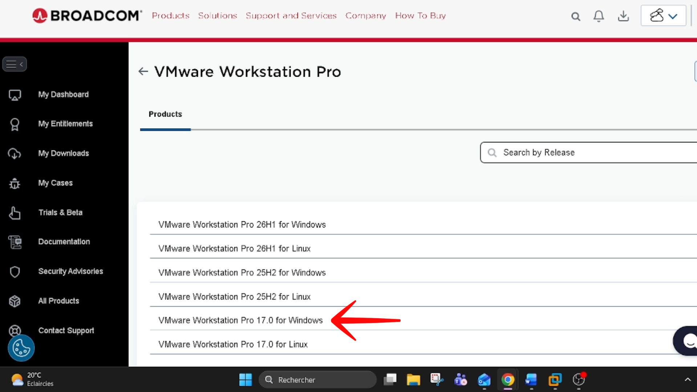

12. Choisissez la version de votre choix ; pour ma part, je sélectionne la plus récente pour avoir toutes les dernières nouveautés.
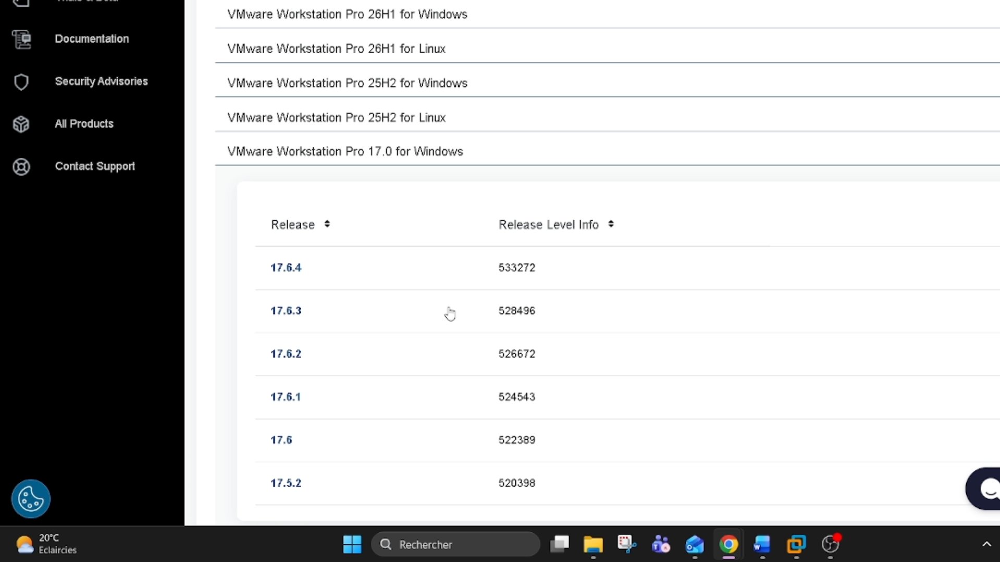

> [!WARNING]
> ### ⚠️ Déblocage du bouton de téléchargement
> Avant de pouvoir cocher la case d'acceptation, vous **devez impérativement cliquer sur le lien hypertexte des Terms and Conditions**.
> 
> 1. Cliquez sur le lien **Terms and Conditions** pour l'ouvrir.
> 2. Revenez sur l'onglet du formulaire : la case à cocher sera débloquée.
> 3. Cochez la case.

13. Cochez la case débloquée suite à la consultation des conditions.
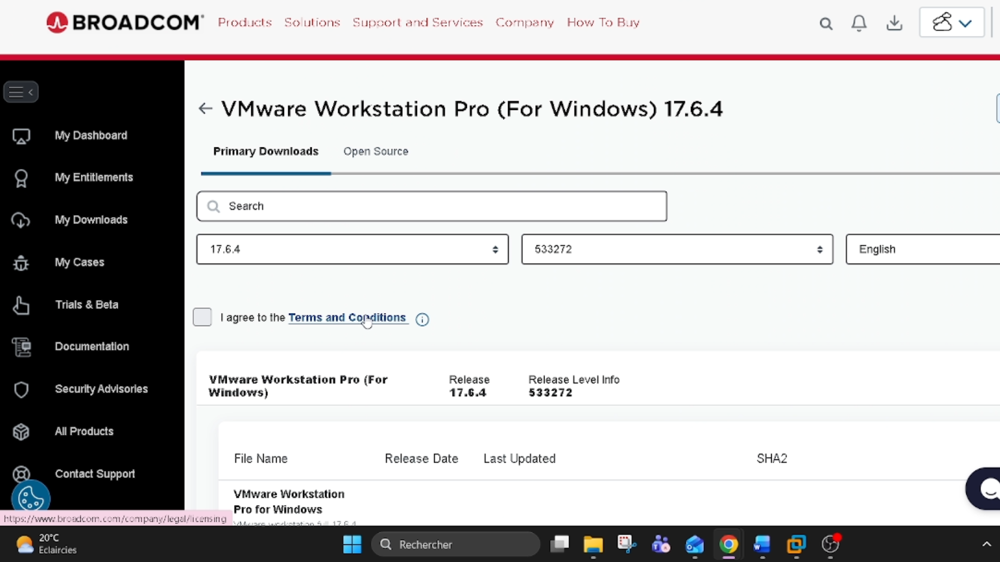
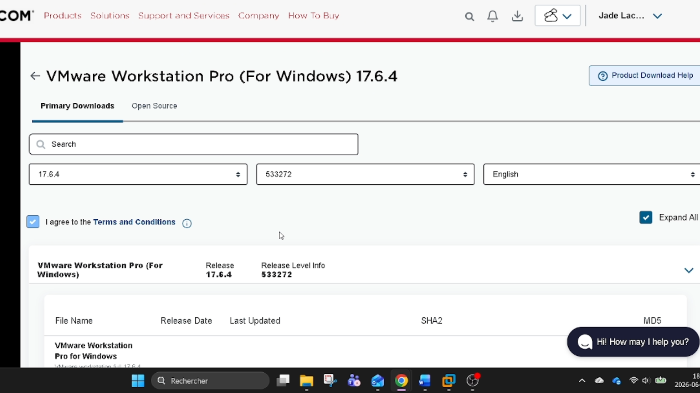

14. Allez ensuite tout au bout à droite de la ligne. Vous allez y trouver un petit **nuage avec une flèche vers le bas**. Cliquez dessus.
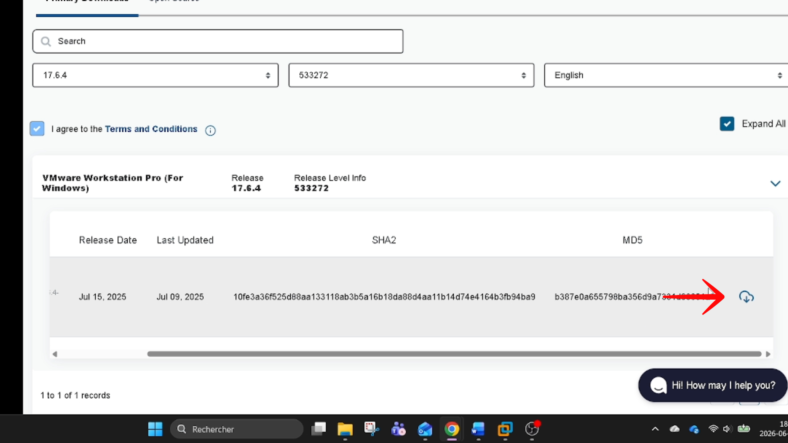

---

## 3. Validation de la conformité (Trade Compliance)

15. Un formulaire de vérification commerciale (*Trade Compliance*) s'affiche avant le premier téléchargement.

16. Remplissez vos informations de résidence (adresse, ville, code postal).

> [!TIP]
> Pour le champ obligatoire **Company** (Entreprise), inscrivez simplement `Personal Use` ou `Home Lab`.

17. Acceptez les termes de conformité en bas, cliquez sur **Submit**, et voilà ! Le téléchargement se lance automatiquement. Vous retrouverez le fichier d'installation soit dans le dossier 'Téléchargements' de votre explorateur de fichiers, soit directement en haut à droite dans les téléchargements de votre navigateur web.
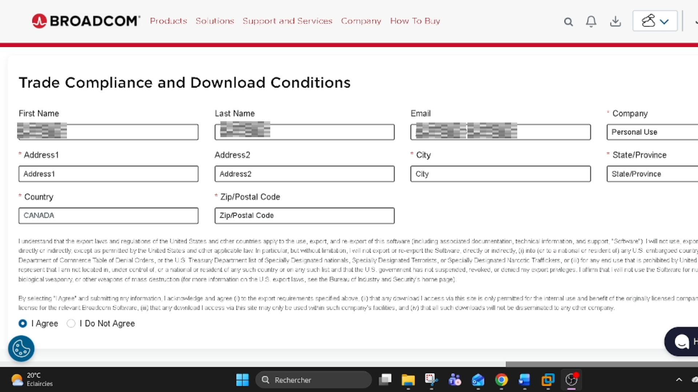

---

## 4. Installation et Configuration de VMware Workstation Pro

18. Double-cliquez sur le fichier téléchargé (`.exe`) pour lancer l'assistant d'installation et acceptez le contrat de licence.
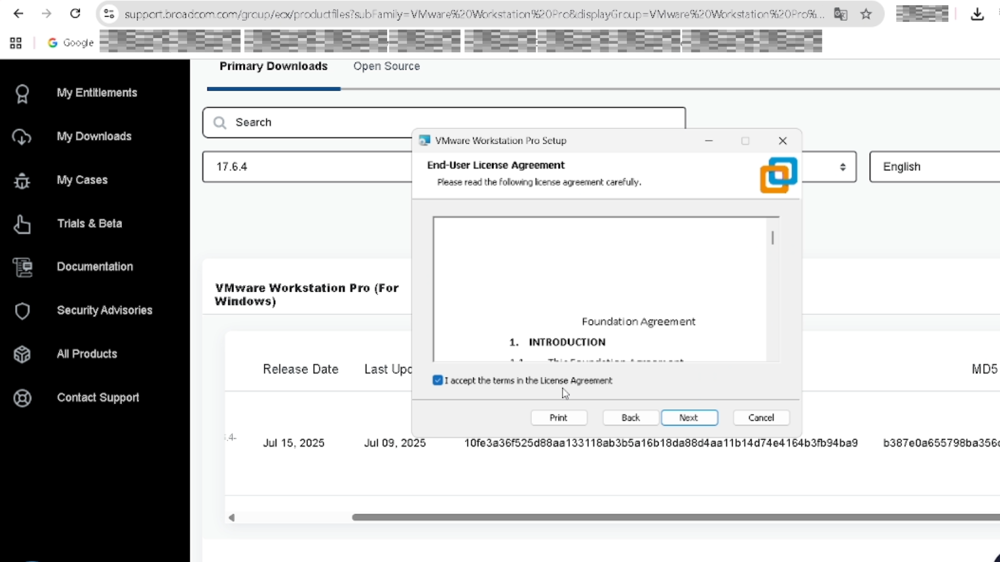

19. **Options de configuration importantes :**

   - **Install Windows Hypervisor Platform automatically :** **À cocher obligatoirement.** Cette option garantit la cohabitation optimale entre VMware et les fonctionnalités réseau/virtualisation de Windows (Hyper-V, WSL2, Windows Sandbox).  
     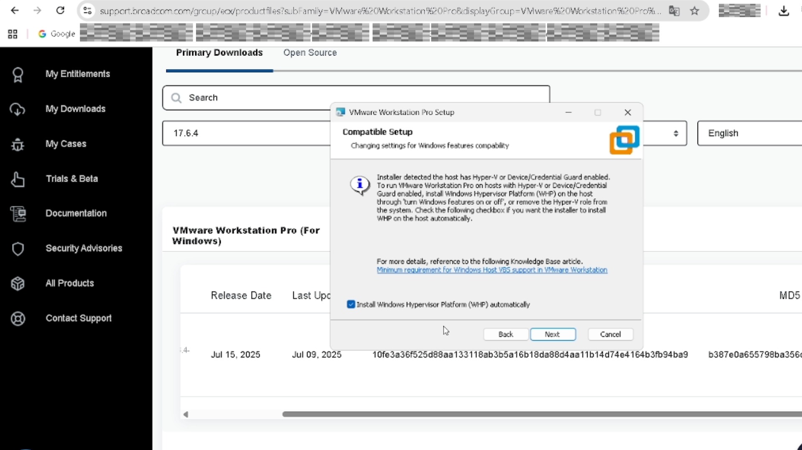

   - **Add VMware Workstation console into system path :** **À cocher.** Ajoute les outils en ligne de commande de VMware aux variables d'environnement système.  
     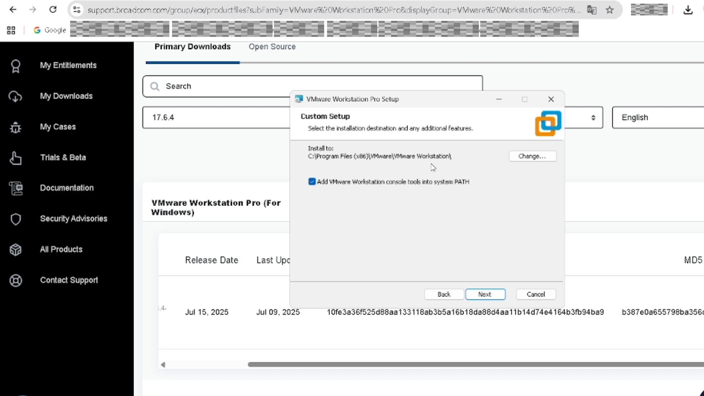

20. Configurez l'expérience utilisateur :
   - Laissez la première option cochée pour la recherche automatique des mises à jour.
   - Dédochez la seconde option si vous ne souhaitez pas envoyer de données télémétriques anonymes.
     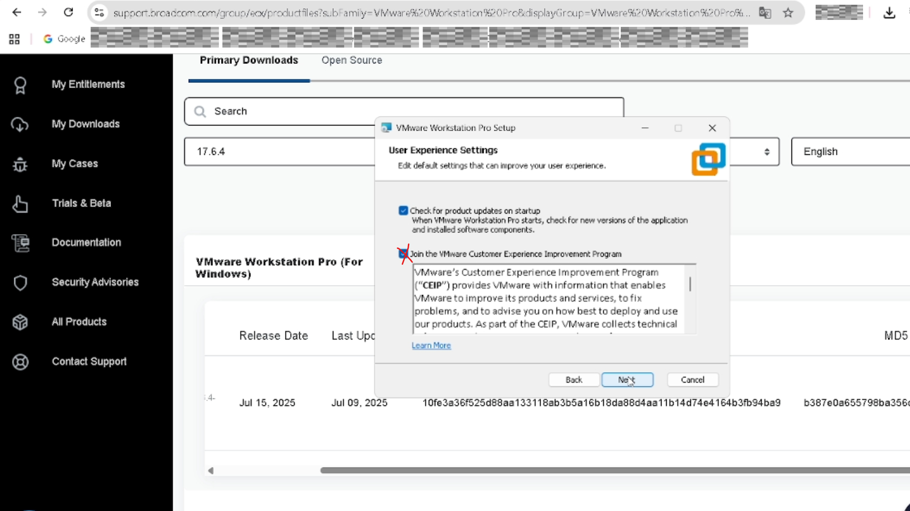

21. Choisissez ensuite si vous voulez un raccourci sur votre bureau et/ou dans votre menu Démarrer, puis cliquez sur **Install**.

Et voilà, c’est tout ! Vous avez désormais un VMware Workstation Pro officiel, complet, performant et surtout 100 % gratuit pour toutes vos futures expérimentations.
